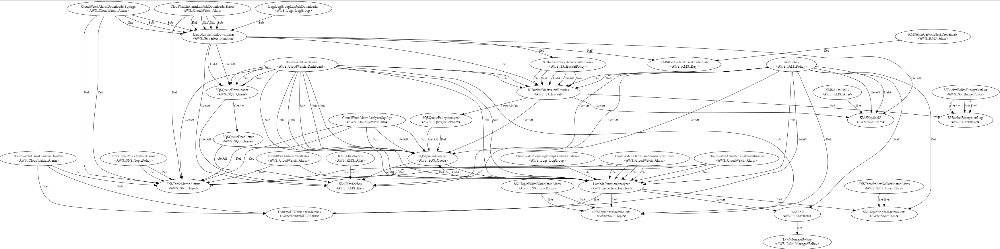

# SAM-BinaryAlert (BETA)

<div align="center"></div>

SAM-BinaryAlert can deploy BinaryAlert with SAR and SAM CLI. \
With SAR you can deploy with just a few clicks.(Required param is `NamePrefix` only) 

[BinaryAlert](http://www.binaryalert.io/) is a serverless, real-time framework for detecting malicious files. (Use cool Terraform) 

\* http://www.binaryalert.io/ \
\* https://github.com/airbnb/binaryalert \
\* SAM is Serverless Application Model\
\* SAR is Serverless Application Repogitory

## BinaryAlert vs SAM-BinaryAlert

|  | BinaryAlert | SAM-BinaryAlert |
| --- | --- | --- |
| Feature | Perfect | Simple, Convenient |
| How to deploy | Terraform | SAM, SAR |
| Functionality | Full | Almost the same.<br>Currently not compatible with Carbon Black |
| Maintainability | Full | The core Lambda application is the same and always up to date (not forking)<br>The infrastructure has been rewritten with the SAM Template. (I will do my best to catch up) |
| Limit | No limit | Each value that needs to be calculated requires parameter setting.<br>Minutes have been changed to seconds, threshold parameters etc. are increasing. <br>(cfn cannot be calculated!) |

## Deployment
There are two types of deployment procedures, SAR and SAM CLI.\
This section describes the procedure using SAM CLI.\
Click here for explanation of SAR.

## Deploy by SAR

1. AWS Web Console Login.
2. SAR [SAM-BinaryAlert](https://console.aws.amazon.com/lambda/home#/create/app?applicationId=arn:aws:serverlessrepo:ap-northeast-1:909044525866:applications/SAM-BinaryAlert) Jump.
3. Set a unique value for the `NamePrefix` parameter. (^[a-z][a-z0-9-_]{3,50}$)
4. Check to I acknowledge that this app creates custom IAM roles and resource policies.
5. Hit the deploy button. 

## Deploy by SAM CLI

### Required environment tools

- Linux / Mac / Windows (Only WSL)
- [AWS SAM CLI >=0.51.0 ](https://docs.aws.amazon.com/serverless-application-model/latest/developerguide/serverless-sam-cli-install.html)

\* SAM-BinaryAlert uses the Makefile feature supported in 0.51 of the SAM CLI. 
- [Release Support for Building \`provided\` runtimes · awslabs/aws-sam-cli](https://github.com/awslabs/aws-sam-cli/releases/tag/v0.51.0)
- [Building Custom Runtimes - AWS Serverless Application Model](https://docs.aws.amazon.com/serverless-application-model/latest/developerguide/building-custom-runtimes.html)


\* Currently, using SAM CLI's `--use-container` does not work with Windows Native.\
 Because the permission in Zip cannot be used. See Issue below.
- [fix: Update external\_attr attribute on the zipfile.ZipInfo before zipping by spaceraccoon · Pull Request #1986 · awslabs/aws-sam-cli](https://github.com/awslabs/aws-sam-cli/pull/1986)

### Procedure manual

```bash
git clone https://github.com/komikoni/sam-binaryalert.git
npm run clone        # or `git clone -b master --depth 1 https://github.com/airbnb/binaryalert.git`
npm run override     # or `cp --recursive binaryalert_override/* binaryalert`
sam build
sam deploy --guided
```

Have a dialogue with CUI of SAM CLI.
Required input is Only `Stack Name`, `AWS Region` and `NamePrefix`.\
Make sure the NamePrefix is ​​globally unique. (E.g. "company_team") \
Otherwise, press the Enter key to proceed. (About 20 times)

The following is a normal log.

```
Configuring SAM deploy
======================

        Looking for samconfig.toml :  Not found
        Setting default arguments for 'sam deploy'
        ========================================= 
        Stack Name [sam-app]: konishi_sba
        AWS Region [us-east-1]: ap-northeast-1
        Parameter NamePrefix []: konishi_sba
        Parameter S3LogBucket []: 
        Parameter S3LogPrefix [s3-access-logs/]: 
        Parameter S3LogExpirationDays [90]: 
        Parameter LambdaLogRetentionDays [14]: 
        Parameter TaggedName [BinaryAlert]: 
        Parameter MetricAlarmSnsTopicArn []: 
        Parameter ExpectedAnalysisFrequencySeconds [1800]: 
        Parameter DynamoReadCapacity [10]: 
        Parameter DynamoWriteCapacity [5]: 
        Parameter LambdaAnalyzeMemoryMb [1024]: 
        Parameter LambdaAnalyzeTimeoutSec [300]: 
        Parameter LambdaAnalyzeTimeoutSecPlus2Sec [302]: 
        Parameter LambdaAnalyzeConcurrencyLimit [100]: 
        Parameter ExternalS3BucketResources []: 
        Parameter ExternalKmsKeyResources []: 
        Parameter EnableNegativeMatchAlerts [false]: 
        Parameter AnalyzeQueueBatchSize [10]: 
        Parameter AnalyzeQueueRetentionSecs [86400]: 
        Parameter AnalyzeQueueRetentionSecs75Percent [64800]: 
        #Shows you resources changes to be deployed and require a 'Y' to initiate deploy
        Confirm changes before deploy [y/N]:
        #SAM needs permission to be able to create roles to connect to the resources in your template
        Allow SAM CLI IAM role creation [Y/n]:
        Save arguments to samconfig.toml [Y/n]: 

        Looking for resources needed for deployment: Not found.
        Creating the required resources...
        Successfully created!

                Managed S3 bucket: aws-sam-cli-managed-default-samclisourcebucket-abcdefghi123
                A different default S3 bucket can be set in samconfig.toml

        Saved arguments to config file
        Running 'sam deploy' for future deployments will use the parameters saved above.
        The above parameters can be changed by modifying samconfig.toml
        Learn more about samconfig.toml syntax at
        https://docs.aws.amazon.com/serverless-application-model/latest/developerguide/serverless-sam-cli-config.html

        Deploying with following values
        ===============================
        Stack name                 : konishi_sba
        Region                     : ap-northeast-1
        Confirm changeset          : False
        Deployment s3 bucket       : aws-sam-cli-managed-default-samclisourcebucket-psgfsj4l65ea
        Capabilities               : ["CAPABILITY_IAM"]
        Parameter overrides        : {'NamePrefix': 'konishi_sba', 'S3LogBucket': '', 'S3LogPrefix': 's3-access-logs/', 'S3LogExpirationDays': '90', 'LambdaLogRetentionDays': '14', 'TaggedName': 'BinaryAlert', 'MetricAlarmSnsTopicArn': '', 'ExpectedAnalysisFrequencySeconds': '1800', 'DynamoReadCapacity': '10', 'DynamoWriteCapacity': '5', 'LambdaAnalyzeMemoryMb': '1024', 'LambdaAnalyzeTimeoutSec': '300', 'LambdaAnalyzeTimeoutSecPlus2Sec': '302', 'LambdaAnalyzeConcurrencyLimit': '100', 'ExternalS3BucketResources': '', 'ExternalKmsKeyResources': '', 'EnableNegativeMatchAlerts': 'false', 'AnalyzeQueueBatchSize': '10', 'AnalyzeQueueRetentionSecs': '86400', 'AnalyzeQueueRetentionSecs75Percent': '64800'}

Initiating deployment
=====================
Uploading to konishi_sba/e3fc50a88d0a364313df4b21ef20c29e  11357 / 11357.0  (100.00%)
Uploading to konishi_sba/ed780b58e525f71eebffb8f7f15d7887  400 / 400.0  (100.00%)
Uploading to konishi_sba/72af956d9647ca8e563b61f3a87568bb  8469979 / 8469979.0  (100.00%)
Uploading to konishi_sba/b33827d70885b39eb325ef3ede479ccf.template  36200 / 36200.0  (100.00%)

Waiting for changeset to be created..
CloudFormation stack changeset
Changeset created successfully. arn:aws:cloudformation:ap-northeast-1:999999999999:changeSet/samcli-deploy1594492160/a05599cf-bc4f-48f6-824c-bd2a0719a402
Waiting for stack create/update to complete
CloudFormation events from changeset
CloudFormation outputs from deployed stack
-----------------------------------------------------------------------------------------------------------------------------------------------------------------------------------------------
Outputs
-----------------------------------------------------------------------------------------------------------------------------------------------------------------------------------------------
Key                 CloudWatchDashboardUrl
Description         CloudWatch dashboard for BinaryAlert
Value               https://ap-northeast-1.console.aws.amazon.com/cloudwatch/home?region=ap-northeast-1#dashboards:name=konishi_sba_BinaryAlert
-----------------------------------------------------------------------------------------------------------------------------------------------------------------------------------------------

Successfully created/updated stack - konishi_sba in ap-northeast-1
```

From next time,
You can deploy with just `sam build && sam deploy`. (Use the previous parameter)

```
sam build && sam deploy
```

## Appendix

### Future roadmap

* Compatible with Carbon Black
* Mutual conversion of samconfig.toml and terraform.tfvars
* Maintenance function with Cloud (SSM Automation Document?)
  * purge_queue
  * retro_fast
  * retro_slow
  * live_test

### SAM Stack image



### Terraform Cloudformation(SAM) Resources Mapping

| # | tf-file | tf-block | tf-resource-type | tf-resource-name |  | cfn-type | cfn-logical-name |
| --- | --- | --- | --- | --- | --- | --- | --- |
| 1 | s3.tf | resource | aws_s3_bucket | binaryalert_log_bucket |  | AWS::S3::Bucket | S3BucketBinaryalertLog |
| 2 | s3.tf | data | aws_iam_policy_document | force_ssl_only_access |  |  |  |
| 3 | s3.tf | resource | aws_s3_bucket_policy | force_ssl_only_access |  | AWS::S3::BucketPolicy | S3BucketPolicyBinaryalertLog |
| 4 | s3.tf | resource | aws_s3_bucket | binaryalert_binaries |  | AWS::S3::Bucket | S3BucketBinaryalertBinaries |
| 5 | s3.tf | data | aws_iam_policy_document | allow_inventory |  |  |  |
| 6 | s3.tf | resource | aws_s3_bucket_policy | allow_inventory |  | AWS::S3::BucketPolicy | S3BucketPolicyBinaryalertBinaries |
| 7 | s3.tf | resource | aws_s3_bucket_inventory | binary_inventory |  |  |  |
| 8 | s3.tf | resource | aws_s3_bucket_notification | bucket_notification |  |  |  |
| 9 | sqs.tf | resource | aws_sqs_queue | analyzer_queue |  | AWS::SQS::Queue | SQSQueue |
| 10 | sqs.tf | data | aws_iam_policy_document | analyzer_queue_policy |  |  |  |
| 11 | sqs.tf | resource | aws_sqs_queue_policy | analyzer_queue_policy |  | AWS::SQS::QueuePolicy | SQSQueuePolicy |
| 12 | lambda.tf | module | binaryalert_analyzer |  |  | AWS::Serverless::Function | LambdaFunction |
|  |  |  |  |  |  | =>AWS::Lambda::Version | LambdaFunctionVersionXXXXXXXXXX |
| 13 | lambda.tf | resource | aws_lambda_event_source_mapping | analyzer_via_sqs |  | =>AWS::Lambda::EventSourceMapping | LambdaFunctionAppEvent |
| 14 | main.tf | resource | aws_lambda_function | function |  | =>AWS::Lambda::Function | LambdaFunction |
| 15 | main.tf | resource | aws_lambda_alias | production_alias |  | =>AWS::Lambda::Alias | LambdaFunctionAliasProduction |
| 16 | main.tf | data | aws_iam_policy_document | lambda_execution_policy |  |  |  |
| 17 | main.tf | resource | aws_iam_role | role |  | AWS::IAM::Role | IAMRole |
| 18 | main.tf | resource | aws_iam_role_policy_attachment | attach_base_policy |  |  |  |
| 19 | main.tf | resource | aws_cloudwatch_log_group | lambda_log_group |  | AWS::Logs::LogGroup | LogsLogGroup |
| 20 | main.tf | resource | aws_cloudwatch_metric_alarm | lambda_errors |  | AWS::CloudWatch::Alarm | CloudWatchAlarmErrors |
| 21 | lambda_iam.tf | data | aws_iam_policy_document | base_policy |  |  |  |
| 22 | lambda_iam.tf | resource | aws_iam_policy | base_policy |  | AWS::IAM::ManagedPolicy | IAMManagedPolicy |
| 23 | lambda_iam.tf | data | aws_iam_policy_document | binaryalert_analyzer_policy |  |  |  |
| 24 | lambda_iam.tf | resource | aws_iam_role_policy | binaryalert_analyzer_policy |  | AWS::IAM::Policy | IAMPolicy |
| 25 | dynamo.tf | resource | aws_dynamodb_table | binaryalert_yara_matches |  | AWS::DynamoDB::Table | DynamoDBTable |
| 26 | sns.tf | resource | aws_sns_topic | yara_match_alerts |  | AWS::SNS::Topic | SNSTopicYaraMatchAlerts |
|  |  |  |  |  |  | AWS::SNS::TopicPolicy | SNSTopicPolicyYaraMatchAlerts |
| 27 | sns.tf | resource | aws_sns_topic | no_yara_match |  | AWS::SNS::Topic | SNSTopicNoYaraMatchAlerts |
|  |  |  |  |  |  | AWS::SNS::TopicPolicy | SNSTopicPolicyNoYaraMatchAlerts |
| 28 | sns.tf | resource | aws_sns_topic | metric_alarms |  | AWS::SNS::Topic | SNSTopicMetricAlarms |
|  |  |  |  |  |  | AWS::SNS::TopicPolicy | SNSTopicPolicyMetricAlarms |
| 29 | kms.tf | data | aws_iam_policy_document | kms_allow_s3 |  |  |  |
| 30 | kms.tf | resource | aws_kms_key | sse_s3 |  | AWS::KMS::Key | KMSKeySseS3 |
| 31 | kms.tf | resource | aws_kms_alias | sse_s3_alias |  | AWS::KMS::Alias | KMSAliasSseS3 |
| 32 | kms.tf | resource | aws_kms_key | sse_sqs |  | AWS::KMS::Key | KMSKeySseSqs |
| 33 | kms.tf | resource | aws_kms_alias | sse_sqs_alias |  | AWS::KMS::Alias | KMSAliasSseSqs |
| 34 | cloudwatch_metric_alarm.tf | resource | aws_cloudwatch_metric_alarm | analyzed_binaries |  | AWS::CloudWatch::Alarm | CloudWatchAlarmNoAnalyzedBinaries |
| 35 | cloudwatch_metric_alarm.tf | resource | aws_cloudwatch_metric_alarm | analyzer_sqs_age |  | AWS::CloudWatch::Alarm | CloudWatchAlarmAnalyzerSqsAge |
| 36 | cloudwatch_metric_alarm.tf | resource | aws_cloudwatch_metric_alarm | yara_rules |  | AWS::CloudWatch::Alarm | CloudWatchAlarmYaraRules |
| 37 | cloudwatch_metric_alarm.tf | resource | aws_cloudwatch_metric_alarm | dynamo_throttles |  | AWS::CloudWatch::Alarm | CloudWatchAlarmDynamoThrottles |
| 38 | cloudwatch_dashboard.tf | resource | aws_cloudwatch_dashboard | binaryalert |  | AWS::CloudWatch::Dashboard | CloudWatchDashboard |
| 39 | sqs.tf | resource | aws_sqs_queue | downloader_queue |  | [WIP] |  |
| 40 | sqs.tf | resource | aws_sqs_queue | dead_letter_queue |  | [WIP] |  |
| 41 | kms.tf | resource | aws_kms_key | carbon_black_credentials |  | [WIP] |  |
| 42 | kms.tf | resource | aws_kms_alias | encrypt_credentials_alias |  | [WIP] |  |
| 43 | lambda.tf | module | binaryalert_downloader |  |  | [WIP] |  |
| 44 | lambda.tf | resource | aws_lambda_event_source_mapping | downloader_via_sqs |  | [WIP] |  |
| 45 | lambda_iam.tf | resource | aws_iam_role_policy | binaryalert_downloader_policy |  | [WIP] |  |
| 46 | lambda_iam.tf | data | aws_iam_policy_document | binaryalert_downloader_policy |  | [WIP] |  |
| 47 | cloudwatch_metric_alarm.tf | resource | aws_cloudwatch_metric_alarm | downloader_sqs_age |  | [WIP] |  |
